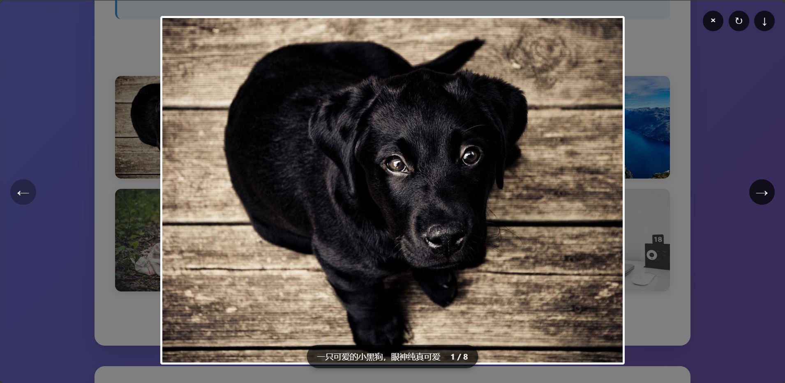
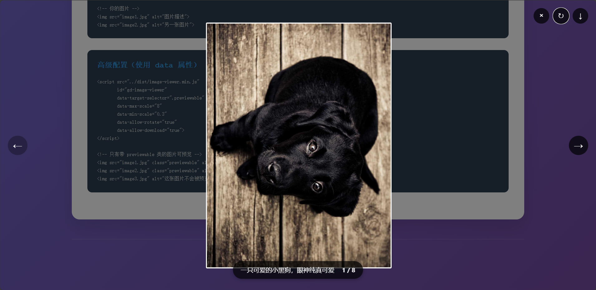
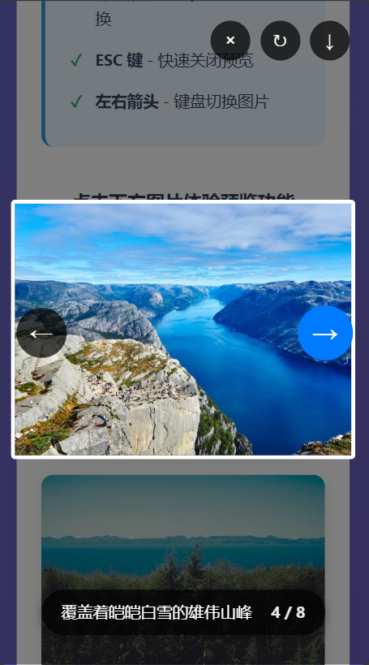

# ImageViewer.js

A lightweight, zero-dependency image previewer Web Component. Just include one JavaScript file to add beautiful image preview functionality to your website.

**Version: 1.0.0**

[中文文档](README.zh-cn.md)

## 🚀 Quick Start

Add the script to your HTML and all images become clickable for full-screen preview:

```html
<script src="https://cdn.jsdelivr.net/gh/mrhuo/image-viewer@1.0.0/dist/image-viewer.min.js"></script>
```

That's it! All `` elements on your page will now open in a beautiful full-screen preview when clicked.

## ✨ Core Features

- **One-line setup** - Just include the script, no configuration needed
- **Zero dependencies** - Pure vanilla JavaScript, works everywhere
- **Full-screen preview** - Click any image for immersive viewing
- **Mouse wheel zoom** - Smooth zoom in/out with mouse wheel
- **Drag to pan** - Move around when zoomed in
- **Keyboard shortcuts** - ESC to close, arrow keys for navigation
- **Multi-image support** - Navigate between multiple images
- **Responsive design** - Works perfectly on all devices

## 📸 Screenshots

<div align="center">
  
  
  <br>
  
</div>

**Desktop Experience** - Full-screen preview with intuitive controls for zoom, rotation, and navigation
<br>
**Mobile Optimized** - Touch-friendly interface with smooth gestures and responsive design

## ⚙️ Advanced Configuration

For custom behavior, you can configure the viewer:

```html
<script id="gd-image-viewer" 
        src="dist/image-viewer.min.js"
        data-target-selector=".gallery-img"
        data-max-scale="8"
        data-min-scale="0.3"
        data-allow-rotate="false"
        data-allow-download="true">
</script>
```

### Configuration Options

| Option | Default | Description |
|--------|---------|-------------|
| `data-target-selector` | `'img'` | CSS selector for clickable images |
| `data-max-scale` | `5` | Maximum zoom level |
| `data-min-scale` | `0.5` | Minimum zoom level |
| `data-allow-rotate` | `true` | Enable image rotation |
| `data-allow-download` | `true` | Enable image download |

### High Definition Preview

``

You can configure the value of the data-highres attribute for img, and clicking on it will open a high-resolution preview image.

## 🛠️ Development

### Build

```bash
npm install
npm run build
```

Creates minified version in `dist/image-viewer.min.js` with ~56.81% size reduction.

### Demo

Open `example/index.html` to see it in action.

## 📄 License

MIT License - see [LICENSE](LICENSE) file for details.

---

Made with ❤️ for the web development community.
